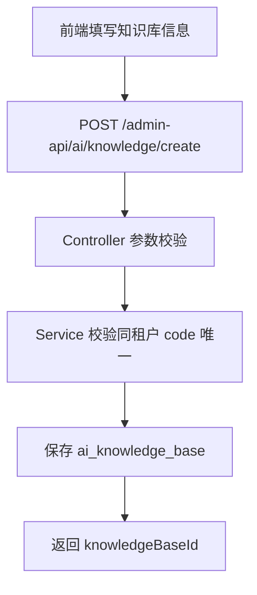
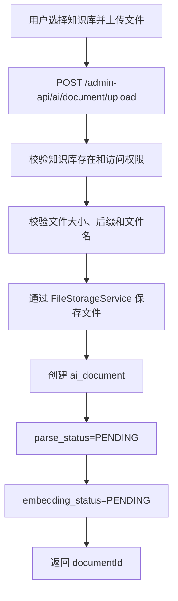
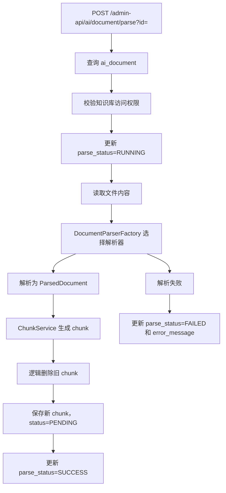
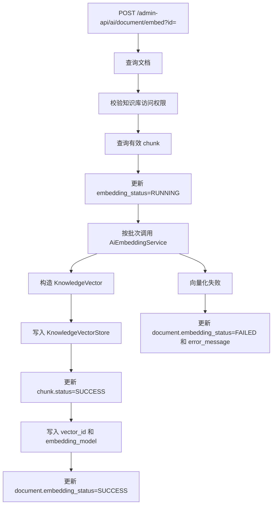
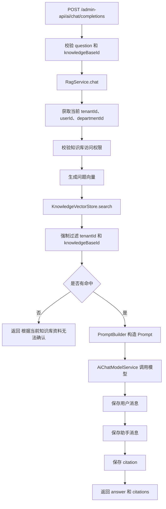
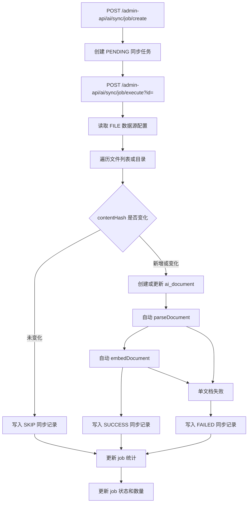

# AI 知识库技术文档

本文档整理当前 `leman-AI-demo` 项目中 AI 知识库模块的业务流程、功能模块、技术实现和后续扩展方向。文档基于当前仓库实现状态编写，适用于后续开发、联调、测试和部署沟通。

## 1. 项目定位

AI 知识库模块面向企业内部资料问答场景，核心目标是把企业文档、文件目录或后续第三方数据源同步为可检索的知识内容，并通过 RAG 流程实现“基于企业知识库资料回答问题”。

当前阶段重点能力：

- 知识库管理
- 数据源管理
- 文档上传、解析、切片、向量化
- PostgreSQL + pgvector 向量存储
- 非流式 RAG 问答
- 问答会话、消息和引用记录
- FILE 类型数据源同步执行
- 前端 AI 知识库菜单与基础页面

## 2. 技术栈

### 2.1 后端

- Java 17
- Spring Boot 3.3.5
- Spring MVC
- Spring Validation
- Spring Security 基础接入
- MyBatis Plus
- MySQL：业务数据存储
- PostgreSQL + pgvector：第一阶段向量库
- Apache POI：Word、Excel、PowerPoint 解析
- PDFBox：PDF 解析
- Maven 多模块工程

后端模块结构：

```text
yudao-module-ai/
  yudao-module-ai-api/
  yudao-module-ai-biz/
yudao-server/
```

`yudao-server` 依赖 `yudao-module-ai-biz`，作为当前后端启动入口。

### 2.2 前端

- Vue 3
- Vite
- TypeScript
- Element Plus
- pnpm
- yudao-ui-admin-vue3 风格

前端目录：

```text
frontend/yudao-ui-admin-vue3/
```

常用命令：

```powershell
pnpm install
pnpm dev
pnpm build:prod
```

## 3. 模块分层

AI 知识库模块遵循 yudao / RuoYi 风格的 Controller、Service、Mapper 分层。

```text
controller.admin
  knowledge      知识库接口
  datasource     数据源接口
  document       文档接口
  sync           同步任务接口
  chat           问答接口和问答记录接口

service
  knowledge      知识库业务
  datasource     数据源业务
  document       文档上传、解析、向量化编排
  chunk          文档切片
  sync           同步任务编排
  rag            RAG 问答编排
  embedding      Embedding 抽象和实现
  chatmodel      Chat 模型抽象和实现
  chatrecord     问答记录查询

framework
  config         ai 配置属性
  parser         文档解析器
  vector         向量库抽象
  vector.pgvector PostgreSQL + pgvector 实现
  vector.qdrant  Qdrant 预留实现
  file           文件存储抽象
  tenant         租户和用户上下文

dal
  dataobject     DO
  mysql          Mapper

convert          对象转换
enums            枚举和错误码
```

## 4. 数据库设计

### 4.1 MySQL 业务表

当前 AI 模块包含以下业务表：

| 表名 | 说明 |
| --- | --- |
| `ai_knowledge_base` | 知识库表，用于存储企业知识库基本信息和配置 |
| `ai_data_source` | 数据源表，用于存储文件、数据库、API、Wiki、Git 等来源配置 |
| `ai_document` | 文档表，用于存储上传或同步文档的基本信息和处理状态 |
| `ai_document_chunk` | 文档切片表，用于存储解析后的 chunk 内容、hash 和向量状态 |
| `ai_sync_job` | 同步任务表，用于记录全量或增量同步任务 |
| `ai_sync_record` | 同步记录表，用于记录每条数据的处理结果 |
| `ai_chat_conversation` | 问答会话表 |
| `ai_chat_message` | 问答消息表，包括用户问题和模型回答 |
| `ai_chat_citation` | 引用来源表，用于保存回答引用的文档和 chunk |

脚本位置：

```text
yudao-module-ai/yudao-module-ai-biz/src/main/resources/sql/mysql/ai-module.sql
yudao-module-ai/yudao-module-ai-biz/src/main/resources/sql/mysql/ai-module-upgrade-20260509.sql
yudao-module-ai/yudao-module-ai-biz/src/main/resources/sql/mysql/system-menu-pages-20260509.sql
```

所有核心业务表均包含：

- `tenant_id`
- `creator`
- `create_time`
- `updater`
- `update_time`
- `deleted`

### 4.2 pgvector 向量表

第一阶段使用 PostgreSQL + pgvector 存储向量数据。

向量表：

```text
ai_vector_store
```

核心字段：

- `vector_id`
- `tenant_id`
- `knowledge_base_id`
- `document_id`
- `chunk_id`
- `content`
- `metadata`
- `embedding vector(1536)`
- `create_time`
- `update_time`

当前 SQL 默认维度为 1536，实际维度需与 Embedding 模型输出保持一致。后续如切换模型，需要同步调整配置和向量表结构。

## 5. 核心业务流程

### 5.1 知识库创建流程



关键校验：

- `name` 必填
- `code` 必填，同租户内不能重复
- `vectorStoreType` 必填
- `chunkSize`、`chunkOverlap`、`topK` 必须合法
- `chunkOverlap` 不能大于 `chunkSize`

### 5.2 文档上传流程



第一阶段上传支持：

- TXT
- PDF
- Markdown

解析器层已经支持更多格式，后续可放开上传限制。

### 5.3 文档解析流程



已实现解析器：

- `TxtDocumentParser`
- `MarkdownDocumentParser`
- `PdfDocumentParser`
- `WordDocumentParser`：支持 `.doc`、`.docx`、`.wps`
- `ExcelDocumentParser`：支持 `.xls`、`.xlsx`、`.xlsb`
- `PowerPointDocumentParser`：支持 `.ppt`、`.pptx`、`.pptm`

### 5.4 文档切片流程

`ChunkService` 根据知识库配置进行切片：

- 优先按段落切分
- 段落过长时按长度切分
- 使用 `chunkSize` 控制单个 chunk 大小
- 使用 `chunkOverlap` 控制相邻 chunk 重叠内容
- 生成连续的 `chunkNo`
- 计算 `contentHash`
- 保存 `metadataJson`
- 状态设为 `PENDING`

同一文档重复解析时，会先逻辑删除旧 chunk，再生成新 chunk，避免出现重复有效切片。

### 5.5 文档向量化流程



Embedding 抽象：

```java
public interface AiEmbeddingService {
    List<Double> embed(String text);
    List<List<Double>> embedBatch(List<String> texts);
}
```

当前实现：

- `MockEmbeddingService`：用于本地测试和无外部模型环境
- `OpenAiCompatibleEmbeddingService`：兼容 OpenAI Embeddings API

敏感配置通过环境变量或配置中心注入，不允许硬编码 API Key。

### 5.6 RAG 问答流程



安全要求：

- 向量检索必须包含 `tenantId`
- 向量检索必须包含 `knowledgeBaseId`
- 问答会话、消息、引用都必须保存 `tenantId` 和 `departmentId`
- 越权访问直接抛业务异常
- 无命中时固定回答：`根据当前知识库资料无法确认`

Chat 模型抽象：

```java
public interface AiChatModelService {
    AiChatModelResponse chat(AiChatModelRequest request);
}
```

当前实现：

- `MockChatModelService`
- `OpenAiCompatibleChatModelService`

### 5.7 FILE 数据源同步流程



设计原则：

- 单个文档失败不导致整个任务完全中断
- 每条处理结果写入 `ai_sync_record`
- `success_count` 和 `fail_count` 可追踪
- 第一阶段同步执行，后续可改为 MQ 异步执行

## 6. 前端功能模块

当前前端新增 AI 知识库菜单：

```text
AI 知识库
  知识库管理
  文档管理
  数据源管理
  同步任务
  问答测试
  问答记录
```

页面目录：

```text
frontend/yudao-ui-admin-vue3/src/views/ai/knowledge-base/
```

主要页面：

| 页面 | 路径 | 说明 |
| --- | --- | --- |
| 知识库管理 | `/ai/knowledge` | 知识库分页、新增、编辑、删除 |
| 文档管理 | `/ai/document` | 按知识库筛选、上传、解析、向量化、删除 |
| 数据源管理 | `/ai/datasource` | 数据源分页、新增、编辑、删除 |
| 同步任务 | `/ai/sync-job` | 创建和执行同步任务 |
| 问答测试 | `/ai/chat-test` | 选择知识库后发起问答，展示引用 |
| 问答记录 | `/ai/chat-record` | 查看会话、消息和引用来源 |

前端 API 目录：

```text
frontend/yudao-ui-admin-vue3/src/api/ai/
```

## 7. 后端接口清单

### 7.1 知识库管理

```text
GET    /admin-api/ai/knowledge/page
GET    /admin-api/ai/knowledge/get?id=
POST   /admin-api/ai/knowledge/create
PUT    /admin-api/ai/knowledge/update
DELETE /admin-api/ai/knowledge/delete?id=
```

### 7.2 数据源管理

```text
GET    /admin-api/ai/datasource/page
GET    /admin-api/ai/datasource/get?id=
POST   /admin-api/ai/datasource/create
PUT    /admin-api/ai/datasource/update
DELETE /admin-api/ai/datasource/delete?id=
```

### 7.3 文档管理

```text
GET    /admin-api/ai/document/page
GET    /admin-api/ai/document/get?id=
POST   /admin-api/ai/document/upload
POST   /admin-api/ai/document/parse?id=
POST   /admin-api/ai/document/embed?id=
DELETE /admin-api/ai/document/delete?id=
```

### 7.4 问答

```text
POST /admin-api/ai/chat/completions
GET  /admin-api/ai/chat/conversation/page
GET  /admin-api/ai/chat/message/list?conversationId=
GET  /admin-api/ai/chat/citation/list?messageId=
```

### 7.5 同步任务

```text
POST /admin-api/ai/sync/job/create
POST /admin-api/ai/sync/job/execute?id=
```

## 8. 配置说明

配置前缀：

```yaml
ai:
  model:
    provider: openai-compatible
    base-url: ${AI_BASE_URL}
    api-key: ${AI_API_KEY}
    chat-model: gpt-4o-mini
    embedding-model: text-embedding-3-small
    connect-timeout-seconds: 10
    read-timeout-seconds: 60
  vector-store:
    type: pgvector
    pgvector:
      table-name: ai_vector_store
      dimensions: 1536
    qdrant:
      host: localhost
      port: 6334
      collection-name: ai_knowledge
  rag:
    default-top-k: 5
    default-score-threshold: 0.7
    max-context-tokens: 6000
    enable-rerank: false
    enable-query-rewrite: false
  document:
    default-chunk-size: 800
    default-chunk-overlap: 100
    max-file-size-mb: 50
    embedding-batch-size: 32
    storage-base-path: .data/ai-documents
```

安全要求：

- 不允许在代码、配置样例或测试中写入真实 API Key
- `AI_BASE_URL` 和 `AI_API_KEY` 通过环境变量、配置中心或部署配置注入
- 日志只能输出脱敏后的密钥信息
- 外部模型调用需要设置超时并记录耗时

## 9. 向量库设计

业务层不直接依赖 pgvector 或 Qdrant SDK，而是依赖统一抽象：

```java
public interface KnowledgeVectorStore {
    void upsert(List<KnowledgeVector> vectors);
    List<KnowledgeHit> search(KnowledgeSearchRequest request);
    void deleteByDocumentId(Long documentId);
    void deleteByKnowledgeBaseId(Long knowledgeBaseId);
}
```

当前实现：

- `MockKnowledgeVectorStore`：测试使用
- `PgVectorKnowledgeVectorStore`：第一阶段真实 pgvector 实现
- `QdrantKnowledgeVectorStore`：预留 TODO 结构

检索请求必须包含：

- `tenantId`
- `knowledgeBaseId`
- `queryEmbedding`
- `topK`
- `scoreThreshold`

其中 `tenantId` 和 `knowledgeBaseId` 是防止跨租户、跨知识库数据泄露的强约束。

## 10. 权限和租户隔离

当前权限控制包含三层：

1. Controller 权限注解：使用菜单权限码控制接口访问。
2. Service 业务校验：校验知识库是否存在、是否同租户、用户部门是否允许访问。
3. 向量检索过滤：检索时强制传入 `tenantId` 和 `knowledgeBaseId`。

知识库可见性：

- 公开知识库：同租户用户可访问
- 部门知识库：用户所属部门在知识库授权部门内才可访问
- 后续可扩展私有知识库、角色授权、用户授权

## 11. 已联调结果

当前已经完成的主链路联调：

- 登录后访问 AI 知识库菜单
- 创建知识库
- 创建 FILE 数据源
- 上传 TXT 文档
- 手动触发解析
- 手动触发向量化
- 问答测试返回答案和引用
- 问答记录展示会话、消息和 citation
- FILE 同步任务自动创建文档、解析、向量化

本地联调时需要注意：

- 后端默认端口：`48080`
- 前端 Vite 当前使用端口：`80`
- MySQL 默认端口：`3306`
- PostgreSQL 默认端口：`5432`
- Qdrant HTTP 默认端口：`6333`
- Qdrant gRPC 默认端口：`6334`

## 12. 未来扩展方向

### 12.1 向量库扩展

- 完整实现 `QdrantKnowledgeVectorStore`
- 支持按配置在 pgvector 和 Qdrant 之间切换
- 支持向量库迁移工具
- 支持多 collection、多 embedding 模型隔离
- 支持向量数据重建和批量清理任务

### 12.2 RAG 能力增强

- Query Rewrite：将用户问题改写为更适合检索的问题
- Rerank：对召回结果进行二次排序
- Hybrid Search：向量检索 + 关键词检索混合召回
- Multi-query Search：多路问题扩展检索
- 上下文压缩：减少无关片段，提高回答准确性
- 引用可追溯：前端支持点击 citation 查看原文 chunk
- 流式输出：支持 SSE 或 WebSocket

### 12.3 文档处理扩展

- 上传支持 Word、Excel、PowerPoint、WPS
- 文档解析改为异步任务
- 大文件分片上传
- 文档病毒扫描和内容安全检测
- OCR 图片识别
- 表格结构化解析
- 文档版本管理
- 文档删除时同步删除向量库数据

### 12.4 数据源扩展

- DATABASE 数据源同步
- API 数据源同步
- Wiki 数据源同步
- Git 仓库同步
- 定时同步任务
- 增量同步任务
- 失败重试和死信队列
- 同步任务 MQ 异步化

### 12.5 权限扩展

- 知识库按角色授权
- 知识库按用户授权
- 文档级权限
- Chunk 级权限过滤
- 操作审计
- 敏感内容脱敏

### 12.6 模型扩展

- 多模型供应商配置
- 按知识库配置 Chat 模型和 Embedding 模型
- 支持国产大模型兼容接口
- 支持模型调用限流
- 支持模型调用成本统计
- 支持 Prompt 模板版本管理

### 12.7 运维和监控扩展

- 向量化进度监控
- 文档解析失败告警
- 模型调用耗时监控
- 向量检索耗时监控
- RAG 命中率统计
- 问答满意度反馈
- 知识库使用报表

## 13. 开发约束

后续开发需要继续遵守以下约束：

- Controller 不写复杂业务逻辑
- Service 负责业务编排
- Mapper 只负责数据访问
- 所有接口必须有基础参数校验
- 外部调用必须有异常处理和日志
- 不允许硬编码 API Key、密码、Token
- RAG 检索必须包含 `tenantId` 和 `knowledgeBaseId`
- 新增功能必须保持现有 yudao / RuoYi 风格
- 修改后需要运行后端编译或相关测试，并说明结果

