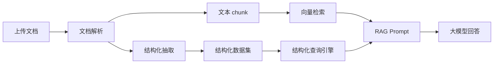

# AI 知识库结构化查询方案

## 背景

通用 RAG 的默认流程是：用户问题 -> Embedding -> 向量检索 topK chunk -> 拼 Prompt -> 大模型回答。

这个流程适合制度解释、流程说明、条款问答，但不适合以下问题：

- 统计数量、汇总金额、计算合计、占比、平均值。
- Excel、Word 表格、PDF 表格中的完整清单分析。
- 多个表之间的关联查询，例如考勤表 + 绩效表 + 员工信息表。
- 需要保证“全量数据已覆盖”才能回答的问题。

根本原因是 topK 只代表“语义最相关片段”，不代表“完整数据集合”。如果让模型只根据部分 chunk 计数，就会出现漏行、重复行、半行截断、跨 chunk 丢上下文等问题。

## 原则

1. 统计类问题不能只依据部分引用片段回答。
2. 如果问题需要完整数据，系统必须先进入完整证据获取流程。
3. 如果完整数据无法获取，系统应明确说明无法确认，而不是让模型猜。
4. 不为每一种业务问题继续增加独立直算分支。
5. 直算能力应收敛为通用结构化查询能力。

## 当前落地策略

第一阶段先在 RAG 编排层增加“结构化文档完整证据扩展”：

1. 识别统计、汇总、数量、合计、清单、占比、平均值等问题。
2. 判断命中的 KnowledgeHit 是否来自结构化文档，例如 Excel、表格型 Word/PDF、包含 Sheet/表头/制表符的内容。
3. 如果命中结构化文档，则按 tenantId、knowledgeBaseId、documentId 读取同一文档下全部有效 chunk。
4. 按 chunkIndex 顺序合并 chunk，并去除 chunkOverlap 导致的重复内容。
5. 使用完整文档内容替换原来的局部命中片段，再进入 PromptBuilder。

这样可以解决“模型只看到表格一部分就开始统计”的问题。

## 目标架构

后续需要把结构化数据从 chunk 中进一步抽取出来，形成可查询的数据层：

建议新增的结构化层：

- `ai_structured_dataset`：一次结构化抽取的数据集。
- `ai_structured_table`：文档中的 Sheet、表格或逻辑表。
- `ai_structured_column`：字段名称、字段类型、字段别名。
- `ai_structured_row`：行数据，JSON 保存原始行。
- `ai_structured_relation`：未来维护表与表之间的关联关系。

## 多表关联查询

多表关联不应直接交给向量检索完成。推荐流程：

1. Query Planner 判断问题是否需要结构化查询。
2. 识别涉及的数据集、表、字段、过滤条件和聚合方式。
3. 生成受控查询计划，而不是直接让模型自由生成 SQL。
4. 查询结构化数据层，得到确定结果。
5. 大模型只负责把查询结果解释成自然语言。

示例：

用户问：“如果我是车间主任，我全勤且满绩效，可以拿多少钱？”

系统应拆解为：

- 当前用户身份：用户姓名、岗位、部门。
- 考勤数据：是否全勤，全勤奖金额。
- 绩效数据：满绩效金额或绩效规则。
- 工资策略：是否属于个人敏感数据，是否允许当前用户查询。
- 最终计算：各项金额相加，并列出依据。

## 生产前要求

- 统计类问题必须有证据完整性标记。
- Prompt 调试信息中需要说明是否走了完整文档扩展或结构化查询。
- 超出上下文长度的统计问题不能截断后直接回答，应转结构化查询或返回无法确认。
- 个人敏感数据必须先通过权限策略，再进入结构化查询。
- 所有查询必须带 tenantId、knowledgeBaseId、必要时带 departmentId 和 userId。

## 后续路线

短期：

- 已实现统计类问题的结构化文档完整 chunk 扩展。
- 保留现有表名清单、工装统计等直接处理能力，但后续要收敛进结构化查询引擎。

中期：

- 新增结构化数据表。
- Excel/Word/PDF 表格解析时同步写入结构化数据层。
- 增加通用聚合能力：count、sum、group by、filter、distinct。

长期：

- 支持多表关系维护。
- 支持受控 SQL/DSL 查询计划。
- 支持复杂权限、字段脱敏、行级访问控制。
- 支持查询结果缓存和人工校验。
